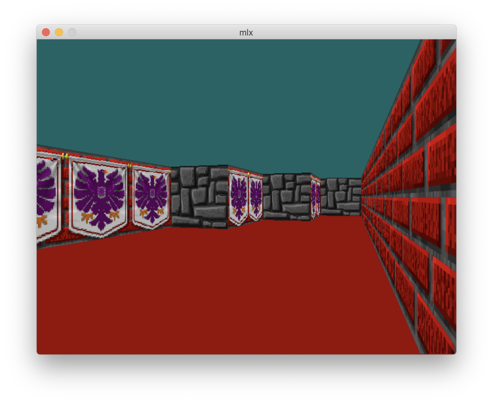

# cub3d



Raycasting is a rendering technique to create a 3D perspective in a 2D map. Back when computers were slower it wasn't possible to run real 3D engines in realtime, and raycasting was the first solution. Raycasting can go very fast, because only a calculation has to be done for every vertical line of the screen. The most well known game that used this technique, is of course Wolfenstein 3D.
[Lode's Computer Graphics Tutorial](https://lodev.org/cgtutor/raycasting.html)

# Usage
```
make && ./cub3D map01.cub
```
# warning
```
Confirmed for Intel mac only
```
